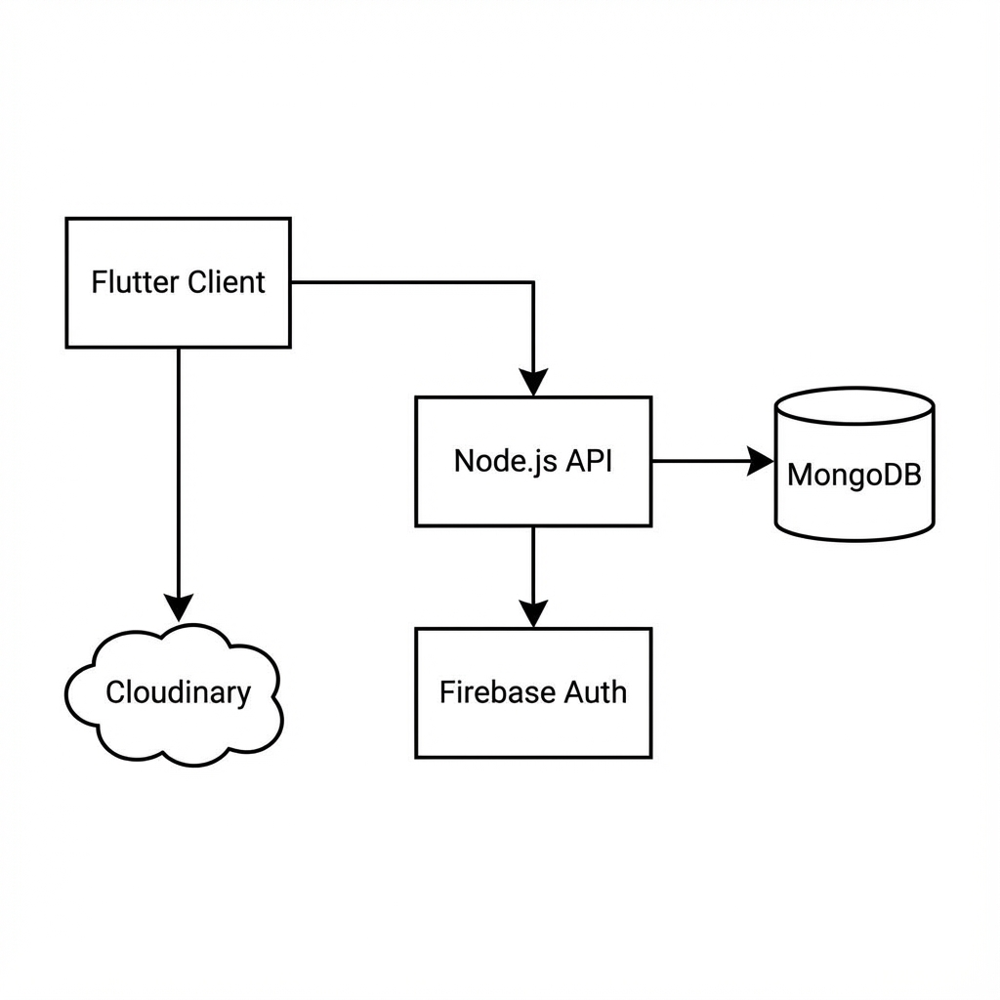
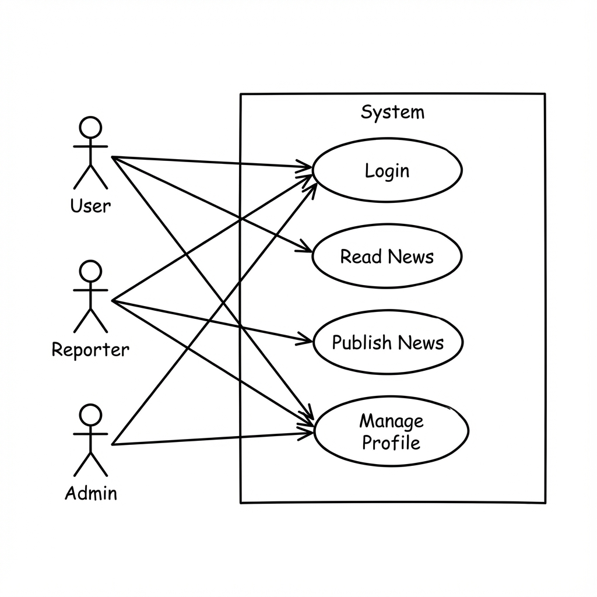
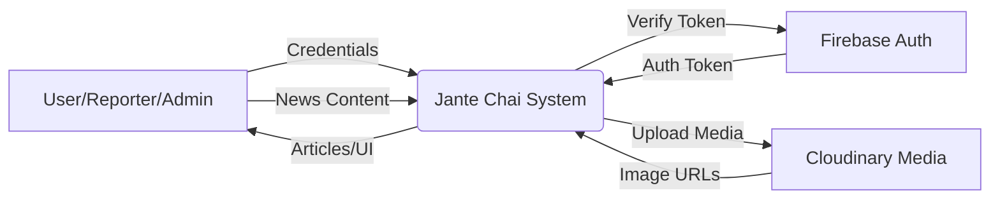
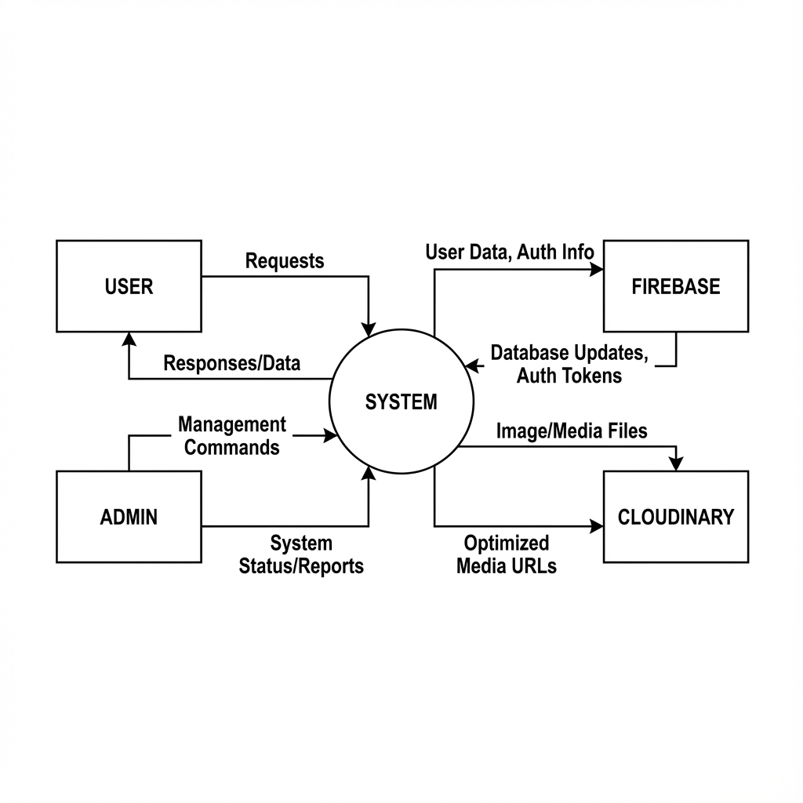
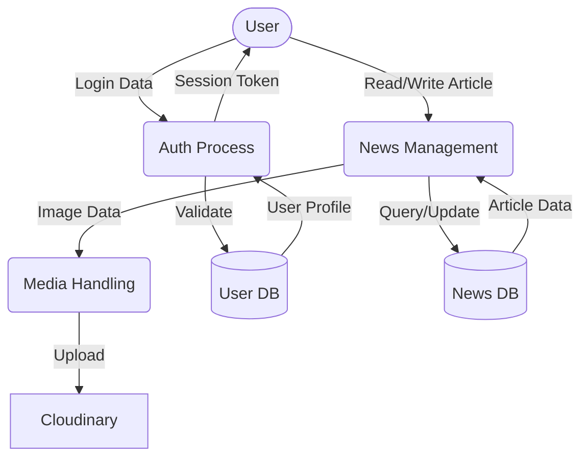
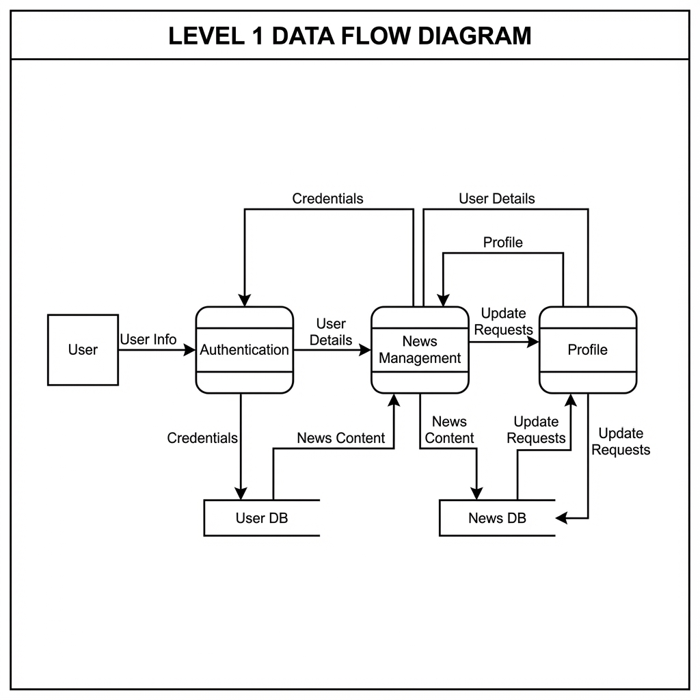

# 3.2.1. Model: Agile SDLC (Iterative & Incremental)

For the development of "Jante Chai", the **Agile Software Development Life Cycle (SDLC)** model was utilized. Specifically, an iterative and incremental approach was adopted.

**Efficiency and Benefits:**
1.  **Iterative Improvements**: The project was developed in small cycles (sprints), allowing for features like Authentication, Dashboard, and News Feeds to be built, tested, and refined independently.
2.  **Flexibility**: Agile allowed the team to adapt to changing requirements in real-time. For example, adding specific web-compatibility fixes (Google Sign-In, Image Uploads) without disrupting the core mobile architecture.
3.  **Continuous Feedback**: Regular testing and "walkthroughs" ensured that bugs (e.g., loading screens, logout issues) were identified and resolved immediately.
4.  **Risk Management**: By delivering functional components early (e.g., basic UI first, then Auth, then complex Logic), critical failure points were identified and mitigated early in the lifecycle.

# Diagrams Source Code (Mermaid)

The following are the precise definitions for the project diagrams. You can view these via any Mermaid-compatible viewer (VS Code, GitHub, etc.).

## 3.2.2. System Architecture

```mermaid
graph TD
    Client[Flutter Client (Mobile/Web)]
    API[Node.js Express API]
    DB[(MongoDB Database)]
    Auth[Firebase Internal Auth]
    Cloud[Cloudinary Storage]

    Client -->|HTTP / REST| API
    Client -->|Auth SDK| Auth
    API -->|Validation| Auth
    API -->|CRUD Data| DB
    Client -->|Upload/View Images| Cloud
    API -->|Manage Assets| Cloud
```




## 3.2.3. Use Case Diagram

```mermaid
usecaseDiagram
    actor "User" as U
    actor "Reporter" as R
    actor "Admin" as A

    package "Jante Chai App" {
        usecase "Login / Register" as UC1
        usecase "View News" as UC2
        usecase "Save Article" as UC3
        usecase "Comment on News" as UC4
        usecase "Publish News" as UC5
        usecase "Manage Content" as UC6
        usecase "Manage Users" as UC7
    }

    U --> UC1
    U --> UC2
    U --> UC3
    U --> UC4

    R --> UC1
    R --> UC2
    R --> UC5

    A --> UC1
    A --> UC2
    A --> UC6
    A --> UC7
```




## 3.2.4. Context Level Diagram (DFD-0)






## 3.2.5. Data Flow Diagram (DFD-1)




